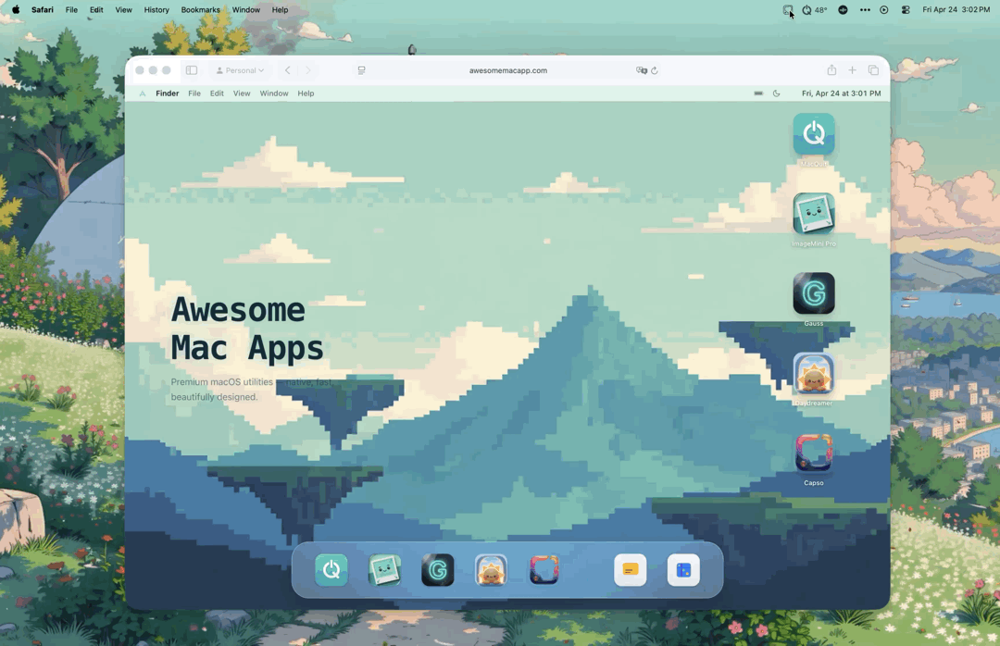

<p align="right">
  <strong>English</strong> | <a href="README.zh-CN.md">简体中文</a> | <a href="README.ja.md">日本語</a> | <a href="README.ko.md">한국어</a>
</p>

# Capso

**Open-source screenshot and screen recording for macOS.**

A native, feature-rich alternative to CleanShot X. Built with Swift 6.0 and SwiftUI, targeting macOS 15.0+.

[](https://www.apple.com/macos/)
[](https://swift.org)
[](LICENSE)
[](https://github.com/lzhgus/Capso/stargazers)

<p align="center">
  <a href="https://www.producthunt.com/products/capso?embed=true&utm_source=badge-top-post-badge&utm_medium=badge&utm_campaign=badge-capso" target="_blank" rel="noopener noreferrer"></a>
</p>

<p align="center">
  
</p>

<p align="center">
  <a href="https://github.com/lzhgus/Capso/releases/latest"><strong>Download &rarr;</strong></a> &nbsp;&bull;&nbsp;
  <a href="https://www.awesomemacapp.com/app/capso">Website</a> &nbsp;&bull;&nbsp;
  <a href="https://x.com/lzhgus">Follow @lzhgus</a> &nbsp;&bull;&nbsp;
  <a href="#features">Features</a> &nbsp;&bull;&nbsp;
  <a href="#build-from-source">Build from Source</a>
</p>

---

## Download

Grab the latest signed, notarized DMG from [**GitHub Releases →**](https://github.com/lzhgus/Capso/releases/latest)

Or install via Homebrew:

```bash
brew tap lzhgus/tap
brew install --cask capso
```

Or [build from source](#build-from-source).

> Screen recording, camera, and microphone permissions are required. The app will prompt on first use.

---

## Why Open Source?

Every macOS screenshot tool worth using costs money — CleanShot X is $29, Cap is $58. They're excellent apps, but a core productivity feature shouldn't be locked behind a paywall.

Capso is our answer: a **fully native, feature-complete alternative** that's free forever, built in the open, and architected so the underlying pieces (CaptureKit, AnnotationKit, OCRKit…) are reusable SPM packages you can drop into your own app.

We make our money from [other tools](https://www.awesomemacapp.com/). Capso exists to give back to the macOS community and to show what a modern, modular Swift 6 app can look like.

---

## Features

### All-in-One Capture
- **CleanShot-style capture HUD** — choose Area, Fullscreen, Window, Scrolling, Timer, OCR, or Recording from one floating toolbar
- **Adjustable selection** — resize or move the capture area before committing, with dimmed surroundings and a bright selected region
- **Aspect-ratio and fixed-size presets** — quickly switch between Freeform, 1:1, 4:3, 16:9, and custom fixed pixel sizes
- **Inline annotation** — draw arrows, shapes, text, highlights, and pixelation directly on the captured area before saving or copying

### Screenshots
- **Area capture** — drag to select with dimension display; press **R** to cycle aspect ratio and fixed-size presets (1:1, 16:9, 1920×1080, custom)
- **Fullscreen capture** — one-click full screen
- **Window capture** — click any window to capture
- **Scrolling capture** — capture long webpages, chat threads, and documents into one stitched image
- **Quick Access** — floating preview with copy, save, annotate, OCR, pin, and drag-and-drop

### Screen Recording
- **Video (MP4)** and **GIF** recording
- **Webcam PiP** — 4 shapes (circle, square, portrait, landscape), drag-resize, snap-to-corners
- **Camera presentation mode** — click PiP to expand fullscreen, click again to restore
- **System audio + microphone** capture
- **Recording controls** — pause, stop, restart, delete, timer
- **Countdown overlay** — 3-2-1 before recording starts
- **Export quality presets** — Maximum, Social, Web
- **Recording editor** — trim, zoom suggestions, cursor smoothing, background styling, and MP4/GIF export in one flow
- **Live composited preview** — see zoom, cursor, and background changes before export

### Annotation Editor
- Arrow, rectangle, ellipse, text, freehand drawing, pixelate/blur, crop
- Highlighter and counter (numbered markers) tools
- Color picker, stroke controls, undo/redo
- **Inline edit mode** — annotate an area capture in place without first saving the original screenshot
- **Screenshot beautification** — background color, padding, rounded corners, shadow

### OCR (Text Recognition)
- **Instant OCR** — select area, text copied to clipboard
- **Visual OCR** — highlighted text regions, click to select individual blocks

### Translation
- **Capture & Translate** — select any screen area, extract text with OCR, and show translated text in a floating card
- **Flexible language controls** — change the target language from the result card, pin it above other windows, or launch translation from Quick Access

### Screenshot History
- **Persistent library** — browse screenshots, GIFs, and recordings in one place
- **Built-in actions** — filter captures, copy, save, show in Finder, and delete without leaving Capso
- **Retention controls** — keep history automatically and choose how long entries stay around

### More
- **Pin to Screen** — float screenshots as always-on-top windows with lock/click-through mode
- **Global keyboard shortcuts** — fully configurable
- **Preferences** — comprehensive settings with Apple Liquid Glass design
- **Localization** — English, Simplified Chinese, Japanese, Korean

### Cloud Sharing (Optional)
- **Bring-your-own storage** — point Capso at your own Cloudflare R2 bucket; we never run a hosted service
- **One-click upload** — click the cloud icon in Quick Access, or use the **⌥⇧0** shortcut to capture-and-share in one step
- **History integration** — upload past captures from the History window, or copy any previously-shared link with one click
- **Setup wizard** in Preferences → Cloud Share — 5-minute guided R2 configuration, with Test Connection and Reset
- **Zero project cost** — your captures, your storage, your bill (R2 has 10 GB free + zero egress fees)
- Future provider support: Backblaze B2, AWS S3, generic S3-compatible — coming in a future release

<p align="center">
  <br>
  <em>Annotation editor with drawing tools, counters, and markers</em>
</p>

<p align="center">
  <br>
  <em>Screenshot beautification — background, padding, corners, shadow</em>
</p>

<p align="center">
  <br>
  <em>Screen recording with webcam PiP and GIF/Video options</em>
</p>

See more screenshots and a full walkthrough on the [**Capso website →**](https://www.awesomemacapp.com/app/capso)

---

## Comparison

| | CleanShot X | Shottr | Cap | **Capso** |
|---|---|---|---|---|
| Screenshots | Full | Full | Basic | **Full** |
| All-in-One HUD | Yes | No | No | **Yes** |
| Recording | Video + GIF | No | Video + GIF | **Video + GIF** |
| Webcam PiP | Yes | No | Yes | **Yes (4 shapes)** |
| OCR | Yes | Yes | No | **Yes** |
| Annotation | Advanced | Advanced | Basic | **Advanced** |
| Pin to Screen | Yes | Yes | No | **Yes** |
| Beautification | Yes | No | Yes | **Yes** |
| Native Swift | Yes | Yes | No (Tauri) | **Yes (Swift 6)** |
| Open Source | No | No | Partial | **Yes** |
| Price | $29 | $8 | $58 | **Free** |

---

## Build from Source

**Requirements:** Xcode 16+, macOS 15.0+, [XcodeGen](https://github.com/yonaskolb/XcodeGen)

```bash
# Install XcodeGen if you don't have it
brew install xcodegen

# Clone and build
git clone https://github.com/lzhgus/Capso.git
cd Capso
xcodegen generate
open Capso.xcodeproj
# Build and run in Xcode (Cmd+R)
```

Or build from the command line:

```bash
xcodegen generate
xcodebuild -project Capso.xcodeproj -scheme Capso -configuration Release build
```

---

## Architecture

Capso uses a modular SPM (Swift Package Manager) architecture. The app is a thin SwiftUI + AppKit shell; all core capabilities live in 12 independent packages.

```
Capso/
├── App/                     # Main app target (thin shell)
│   ├── CapsoApp.swift       # @main entry point
│   ├── MenuBar/             # Menu bar controller
│   ├── Capture/             # Capture overlay, All-in-One HUD, pinned screenshots
│   ├── Recording/           # Recording coordinator, controls, toolbar
│   ├── Editor/              # Recording editor, timeline, preview, export UI
│   ├── Camera/              # Webcam PiP window
│   ├── AnnotationEditor/    # Annotation editor, inline annotation + beautify
│   ├── OCR/                 # OCR coordinator, overlay, toast
│   ├── Translation/         # Capture translation flow and result card
│   ├── History/             # Screenshot history window
│   ├── QuickAccess/         # Floating preview window
│   └── Preferences/         # Settings window
├── Packages/
│   ├── SharedKit/           # Settings, permissions, utilities
│   ├── CaptureKit/          # ScreenCaptureKit wrapper
│   ├── RecordingKit/        # Screen recording engine
│   ├── CameraKit/           # AVFoundation webcam capture
│   ├── AnnotationKit/       # Drawing/annotation system
│   ├── OCRKit/              # Vision framework OCR
│   ├── ExportKit/           # Video/GIF export + composited editor export
│   ├── EffectsKit/          # Cursor telemetry, click highlights, effects
│   ├── EditorKit/           # Recording editor models, compositor, zoom/cursor logic
│   ├── HistoryKit/          # Persistent screenshot/recording history
│   ├── ShareKit/            # Cloud sharing destinations and uploads
│   └── TranslationKit/      # OCR-backed translation service models
└── project.yml              # XcodeGen project definition
```

Each package can be tested independently:

```bash
swift test --package-path Packages/SharedKit
swift test --package-path Packages/AnnotationKit
# etc.
```

The package split means you can embed, for example, `CaptureKit` or `AnnotationKit` in your own app without pulling in the entire Capso shell — something no Electron- or Tauri-based alternative can offer.

---

## Roadmap

- Spotlight, magnifier, ruler, image overlay annotation tools
- Emoji support and custom fonts in text annotations
- URL scheme API for automation
- Raycast / Shortcuts integration

See [open issues](https://github.com/lzhgus/Capso/issues) for current priorities and [GitHub Releases](https://github.com/lzhgus/Capso/releases) for version history. Contributions welcome!

---

## Contributing

See [CONTRIBUTING.md](CONTRIBUTING.md) for development setup and guidelines.

---

## License

Capso is licensed under the [Business Source License 1.1](LICENSE).

**TL;DR:**

| What you want to do | Allowed? |
|---|---|
| Use Capso personally | ✅ |
| Use Capso inside your company | ✅ |
| Read, modify, and build from source | ✅ |
| Fork it and ship a free derivative | ✅ |
| Fork it and sell a competing screen-capture product | ❌ |
| Any use after 2029-04-08 | ✅ Becomes Apache 2.0 |

The license auto-converts to Apache 2.0 three years after each release — so every version eventually becomes fully permissive open source.

---

## Support

- [Report a bug](https://github.com/lzhgus/Capso/issues/new?template=bug_report.yml)
- [Request a feature](https://github.com/lzhgus/Capso/issues/new?template=feature_request.yml)
- [Follow @lzhgus on X](https://x.com/lzhgus) for release notes, behind-the-scenes updates, and other macOS tools

If Capso saves you time, a small tip keeps it growing — every bit funds more polish, more features, fewer bugs.

<p align="center">
  <a href="https://x.com/lzhgus">
    
  </a>
  &nbsp;
  <a href="https://github.com/sponsors/lzhgus">
    
  </a>
  &nbsp;
  <a href="https://buymeacoffee.com/lzhgus">
    
  </a>
</p>

<p align="center">
  Built by <a href="https://www.awesomemacapp.com/">Awesome Mac Apps</a> — check out our other macOS tools.
</p>
